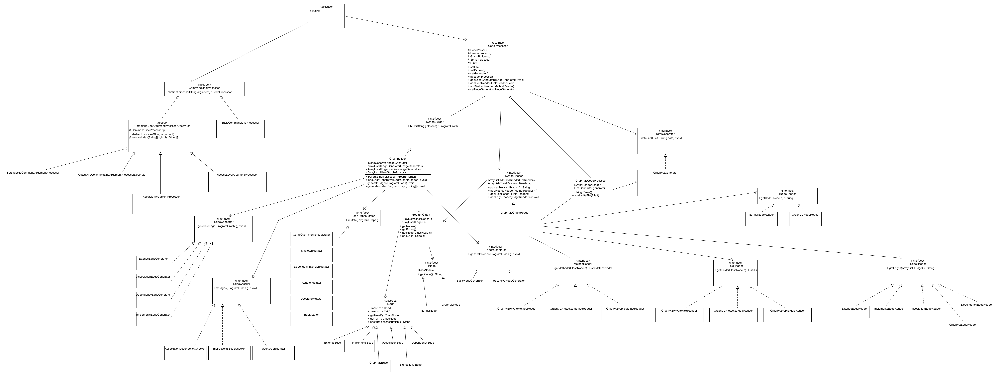

#SwagLagUMLGenerator

This is our term project for our Software Design course.
This project can generate a UML diagram of java code given and identify various design patterns.

To run this program, you can use the command line:
java -jar SwagLagUMLGenerator.jar <command line arguments\>

##Command Line Arguments:

*		of=<filepath\> 
	*		output data to file path
*		whitelist=<class1,class2,...\>
	*		list of classes to be part of the uml
*		recursive=<true|false\>
	*		select if you would like to recursively discover new nodes that whitelisted classes inherit from
	*		(default: false)
*		blacklist=<prefix1,prefix2,...\>
	*		list of class prefixes that you do not want to show up in uml from recursive node generation
*		access=<private|public|protected\>
	*		private: display all private, public, and protected methods and fields
	*		public: display only public methods and fields
	*		protected: display only protected and public methods and fields
	*		(default: private)
*		patterns=<PatternDetector1,PaternDetector2,...\>
	*		list of class names for user-made pattern detectors. These mutators must implement IUserGraphMutator
*		cfg=<filepath\>
	*		filepath for configuration file 
	*		(default: default.cfg)

##UML:

